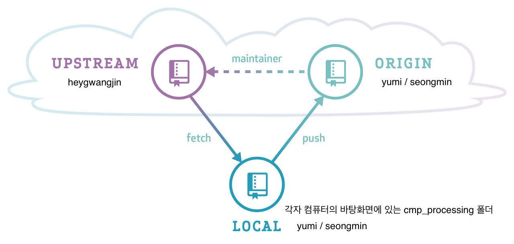

# CMP Processing Team06 Project

## Credits
- 202011111 Yu-mi Jun

## Git

### Rules for using git

1. 작업하기 전, UPSTREAM(heygwangjin) 원격 저장소의 변경 내역을 LOCAL(yumi, seongmin의 컴퓨터)에 반영한 후, 각자의 원격 저장소인 ORIGIN(yumi, seongmin의 Github 원격 저장소)에 반영하기 위해 아래의 명령어들을 실행한다.
    - `git fetch upstream` -> UPSTREAM의 변경 이력을 가져온다.
    - `git checkout main` -> LOCAL의 main 브랜치로 이동한다.
    - `git merge upstream/main` -> upstream/main 브랜치를 LOCAL의 main 브랜치에 병합한다.
    - `git push` -> LOCAL의 main 브랜치의 내용을 ORIGIN에 반영한다.
2. 새로운 기능을 추가할 때마다 추가할 기능의 이름으로 새로운 브랜치를 생성하여 작업을 진행한다. ex) git branch playbutton (해당 명령어 실행 후, git checkout playbutton 명령어를 실행해야 생성한 브랜치로 이동이 된다.)
3. 기능 구현이 완료되면, add, commit, push를 실행하여 완료 된 기능을 ORIGIN에 반영한다. ex) git push origin playbutton (push할 때, 기능 이름으로 생성 된 브랜치 이름 꼭 명시해주세요!)
4. 자신의 ORIGIN인 Github 웹 사이트에 들어가서 Pull Request를 생성한다.
5. Pull Request가 완료되면, 기능 구현할 때 사용하던 브랜치를 삭제한다.
    - `git checkout main`
    - `git branch -d playbutton` (playbutton 은 예시)
6. 위의 1~5를 반복한다.

### Reference related to git
- [직관적으로 이해하는 git & GitHub](https://deepinsight.tistory.com/78)
- [다른 사람의 원격 저장소로부터 협업하는 방법](https://deepinsight.tistory.com/167)
